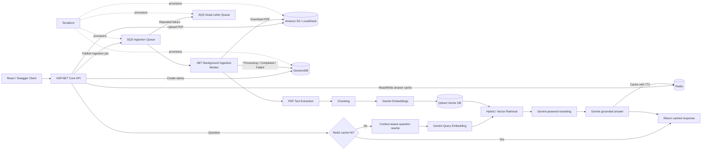

# Healthcare Document Intelligence Platform

A production-oriented healthcare Retrieval-Augmented Generation (RAG) platform built with **C#/.NET 8, ASP.NET Core, React/TypeScript, Gemini, Qdrant, AWS-compatible cloud services, Redis, Docker, and Terraform**.

The platform allows users to upload healthcare policy/workflow PDFs and ask natural-language questions grounded in those documents. The project extends a standard RAG application with asynchronous ingestion, object storage, queues, failure handling, persistent processing status, caching, idempotency, and Infrastructure as Code.

## Architecture



## Key Engineering Concepts

- **Asynchronous processing:** the upload API stores a PDF and queues an ingestion job instead of performing expensive parsing, embedding, and indexing inside the HTTP request.
- **Producer/consumer architecture:** ASP.NET Core produces SQS messages; a background worker independently consumes and processes them.
- **Object storage:** PDFs are stored in S3 while application metadata and processing state are stored separately.
- **Retries and visibility timeout:** failed SQS messages are not deleted and become available for retry after the visibility timeout.
- **Dead-letter queue:** repeatedly failing ingestion jobs are isolated from the main queue after the configured receive limit.
- **Idempotency:** deterministic document/chunk identifiers allow retries without creating duplicate vector records.
- **Eventual consistency:** an upload returns `202 Accepted` before background ingestion is complete. Clients can query document status separately.
- **Redis cache-aside:** repeated RAG questions can be answered from Redis with a TTL rather than recomputing embeddings, retrieval, reranking, and generation every time.
- **Resilience:** Gemini HTTP clients use timeouts and bounded retry with exponential backoff for transient failures.
- **Infrastructure as Code:** Terraform defines the S3 bucket, SQS ingestion queue, DLQ, and DynamoDB table declaratively.

## Technology Stack

### Application
- C# / .NET 8
- ASP.NET Core Web API
- React / TypeScript
- Semantic Kernel / Gemini integration

### Retrieval and AI
- Gemini embeddings and generation
- Qdrant vector database
- PDF parsing and overlapping text chunking
- Hybrid semantic + keyword retrieval
- Query rewriting and reranking
- Source attribution

### Cloud / Distributed Systems
- Amazon S3-compatible object storage
- Amazon SQS-compatible message queue
- SQS Dead Letter Queue
- DynamoDB-compatible processing-status store
- Redis distributed cache
- Background worker / producer-consumer processing

### Infrastructure
- Docker Compose
- LocalStack for local AWS-compatible development
- Terraform

## Document Ingestion Flow

1. Client uploads a PDF to `POST /api/documents/upload`.
2. ASP.NET Core validates the request.
3. The original PDF is uploaded to S3-compatible object storage.
4. A document-processing record is written with status `Queued`.
5. A `DocumentIngestionMessage` containing the document ID, S3 object key, department, document type, and file name is published to SQS.
6. The API immediately returns `202 Accepted`.
7. The background worker polls SQS using long polling.
8. The worker marks the document `Processing`.
9. It downloads the PDF from S3.
10. Text is extracted and split into overlapping chunks.
11. Gemini generates embeddings for each chunk.
12. Deterministic chunk IDs are generated so retries remain idempotent.
13. Chunks and vectors are upserted into Qdrant.
14. The document is marked `Completed` and the SQS message is deleted.
15. If processing fails, the message is left in SQS and becomes available again after the visibility timeout.
16. After the configured maximum receive count, SQS moves the message to the DLQ.

## RAG Query Flow

1. Client submits a healthcare question.
2. Conversation history is used to rewrite ambiguous follow-up questions into standalone questions.
3. A deterministic Redis cache key is generated from the rewritten question.
4. On a cache hit, the previously generated response is returned immediately.
5. On a cache miss, Gemini generates a query embedding.
6. Qdrant and keyword search retrieve relevant chunks.
7. Retrieved chunks are filtered/reranked.
8. Gemini generates an answer grounded in the retrieved context.
9. The response and sources are cached in Redis with a TTL.
10. The grounded response is returned to the client.

## Local Infrastructure

Docker Compose runs the development dependencies:

- LocalStack — AWS-compatible S3, SQS, and DynamoDB APIs
- Qdrant — vector database
- Redis — distributed cache

Start them with:

```bash
docker compose up -d
```

Verify:

```bash
docker ps
```

Expected containers include:

```text
healthcare-localstack
healthcare-qdrant
healthcare-redis
```

## Terraform

Infrastructure is defined under the `terraform/` directory.

Typical workflow:

```bash
cd terraform
terraform init
terraform validate
terraform plan
terraform apply
```

After a successful apply, running `terraform plan` again should report no infrastructure changes when the desired state already matches the actual state.

Terraform manages:

- S3 document bucket
- SQS ingestion queue
- SQS dead-letter queue
- DynamoDB processing-status table

## API Behaviour

### Upload Document

```http
POST /api/documents/upload
```

Example response:

```json
{
  "documentId": "cf59381c-64ca-465f-ad74-aa4a76ad9e04",
  "file": "Scheduling Policy.pdf",
  "objectKey": "documents/.../Scheduling Policy.pdf",
  "department": "General",
  "documentType": "KnowledgeBase",
  "status": "Queued"
}
```

Expected status code:

```text
202 Accepted
```

### Check Processing Status

```http
GET /api/documents/{documentId}/status
```

Possible lifecycle:

```text
Queued -> Processing -> Completed
```

Failure lifecycle:

```text
Queued -> Processing -> Retrying -> Retrying -> Failed -> DLQ
```

## Reliability Design

### Visibility Timeout

Receiving an SQS message does not immediately remove it. The message is temporarily hidden while a worker processes it. The worker deletes the message only after successful processing.

If the worker crashes or processing fails, the message becomes visible again and another processing attempt can occur.

### Idempotency

SQS provides at-least-once delivery semantics, so the same ingestion job may be processed more than once. The application uses deterministic chunk identifiers based on document/chunk identity and Qdrant upserts so retries do not create duplicate vector records.

### Dead Letter Queue

A permanently failing document should not retry forever. After the configured receive threshold, SQS routes the message to the DLQ for later investigation.

### Exponential Backoff

Transient Gemini/API failures use bounded HTTP retries with increasing delays. Job-level failures remain protected separately through SQS retry and DLQ behaviour.

## Caching

Redis uses a cache-aside strategy:

```text
Request
  -> Redis lookup
      -> HIT: return response
      -> MISS: execute RAG pipeline -> cache response -> return response
```

Cached responses use a TTL to reduce stale-answer risk when documents change.

## Development Notes

LocalStack is used for local development so the project can exercise AWS SDKs and AWS-style architecture without requiring paid AWS infrastructure. The application should not be described as deployed on AWS unless the same resources are actually deployed to AWS.

In a production environment, credentials should come from IAM roles or an appropriate secret-management mechanism rather than source-controlled access keys.

## Suggested Resume Description

**Healthcare Document Intelligence Platform — Cloud-Native RAG Platform**  
*C#/.NET 8, React/TypeScript, Gemini, Qdrant, AWS S3/SQS/DynamoDB, Redis, Docker, Terraform*

- Designed an asynchronous document-ingestion architecture using S3 object storage, SQS producer/consumer processing, background workers, DynamoDB processing-state tracking, retries, dead-letter queues, and idempotent Qdrant upserts.
- Built an advanced RAG pipeline with PDF chunking, Gemini embeddings, hybrid semantic/keyword retrieval, query rewriting, reranking, source attribution, and conversation-aware question answering.
- Implemented Redis cache-aside with TTL and resilient HTTP clients using bounded retries, timeouts, and exponential backoff to reduce repeated RAG computation and improve tolerance of transient dependency failures.
- Provisioned AWS-compatible S3, SQS/DLQ, and DynamoDB infrastructure using Terraform and ran the complete cloud stack locally with Docker Compose and LocalStack.

## Interview Topics Demonstrated

This project provides practical examples for discussing:

- synchronous vs asynchronous processing
- SQS producer/consumer architecture
- message visibility timeout
- at-least-once delivery
- retries and exponential backoff
- dead-letter queues and poison messages
- idempotency
- cache-aside and TTL
- eventual consistency
- object storage vs relational/document metadata
- background workers
- vector search and RAG
- Infrastructure as Code
- Terraform state and desired state
- Docker-based development environments
